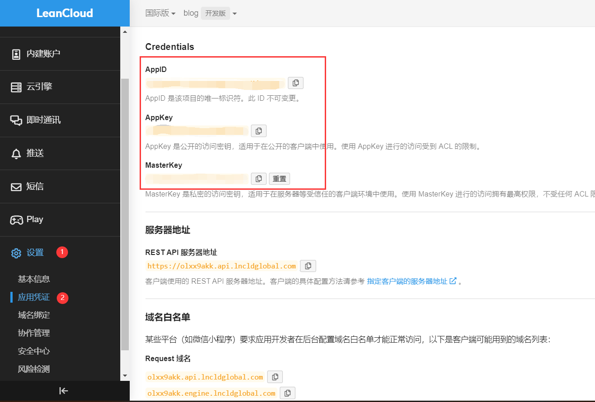

# Set up comment section

Click [here](https://waline.js.org/guide/get-started/) to see the official guide of Waline

## 1. LeanCloud (set a databank)

1. [Sign in](https://console.leancloud.app/login)
2. Create app (Top left corner) and name it (free version)
3. Get APP ID, APP KEY and MASTER KEY


## 2. Vercel (set up service section)

1.  [Click here](https://vercel.com/new/clone?repository-url=https%3A%2F%2Fgithub.com%2Fwalinejs%2Fwaline%2Ftree%2Fmain%2Fexample) sign in for Vercel with github account
2. Create Vercel
3. Create repository with Waline
4. Wait and click “Go to Dashboard”
5. Insert your App ID, APP KEY, and MASTER KEY from LeanCloud in Settings - Environment Variables
6. Developments > Redeploy


## Test your comment block

``````markdown
Open project on Vercel > Settings > Domains: Click on link
``````


## Get Administration

Add /ui/register to the link of your comment block and sign in to get administration

