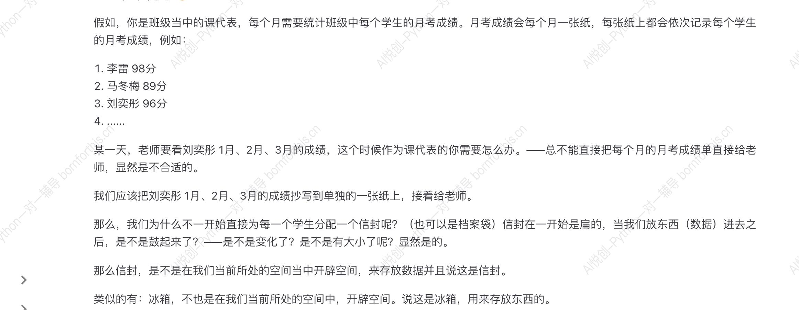
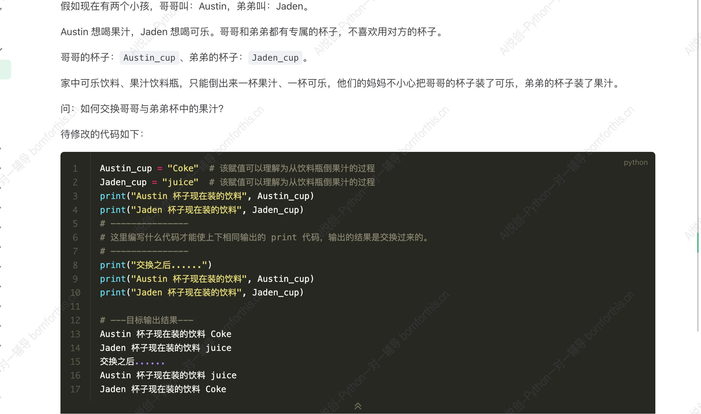

### 1. 理解变量–生活中的例子

### 1.1 从字面意思去理解

- 变：变化
- 量：大小

### 1.2 例子



—— 所以，==变量不就是在计算机的内存当中开辟空间，来存储数据。==

### 1.3 变量的特点

- 变量的值会被覆盖，只会记着最后一个值。

## 2. 如何创建变量——赋值语句

1. 变量：通过变量名代表或引用某个值
    - 女娲捏了泥人，泥人没有生命，所以女娲赋予了泥人生命。此时，泥人可以代表说是女娲的后人。[变量：泥人，值（表达式）：女娲] 泥人 = 女娲

2. 初始化赋值语句：变量名 = 表达式 [`=`叫做：赋值运算符]

    a. 变量名：空间的名字

    b. 表达式：类似数学表达式

3. 程序的运行逻辑：从上到下：从右到左（这里的右，指的是先执行=“右边的整体”），最后才是赋值。
4. 编写代码

```python
x = 1  # 1 赋值给了x，x代表1
x = x + 10  # x + 10 等价于 1 + 10 最后得出 11,11 赋值给 x
print(x)  # print 打印、输出
# 井号是用来注释、注解,解释某一行代码的功能或者作用
```

```python
name1 = "Lili"
name2 = name1
print(name2)
# 变量的值会传递
```

```python
name1 = "Lili"
name1 = "Adar"
print(name1)
# 变量的值会被最后一个值覆盖
```

## 3. 探究print

### 3.1 同时出多个数据

```python
a = 1
b = 2
c = 3
print(a, b, c) # 变量当中会加空格
```

### 3.2 sep 同时修改多个变量输出时的间隔

```python
a = 1
b = 2
c = 3
print(a, b, c, sep="sep")
print(a, b, c, sep="\n") 
print(a, b, c, sep="\n\tabc:")
```

### 3.3 end 修改单个变量输出结尾方式

```python
a = 1
b = 2
c = 3
print(a, end="")
print(b, end="\t")
print(c, end="ending")
```

### 3.4 end 和 sep 可以同时运用

```python
a = 1
b = 2
c = 3
print(a, sep="hhhh")
print(a, b, c, sep="~", end=" love Python")
"""
Output:
1
1~2~3 love Python3
"""
```

### 3.5 添加提示

```python
a = 1
print('value of a:', a)
# 添加提示就是等于同时输出多个变量
```

## 4. 进阶赋值方法

### 4.1 同时赋值多个变量相同的值

```python
a = b = c = 1
print(a, b, c)
```

### 4.2 同时赋值多个变量不同的值

```python
a, b, c = 1, 2, 3
print(a, b, c)
# --output--
# 1 2 3
```

## 5. 测试



```python
Austin_cup = "Coke"     # 该赋值可以理解为从饮料瓶倒果汁的过程
Jaden_cup = "juice"     # 该赋值可以理解为从饮料瓶倒果汁的过程

print("Austin 杯子现在装的饮料", Austin_cup)
print("Jaden 杯子现在装的饮料", Jaden_cup)

# code 1
# Austin_cup_backup = Austin_cup
# Austin_cup = Jaden_cup
# Jaden_cup = Austin_cup_backup

# code2
Jaden_cup, Austin_cup = Austin_cup, Jaden_cup
# 原理:Python运行时会先取值，再赋值

print("交换之后......")
print("Austin 杯子现在装的饮料", Austin_cup)
print("Jaden 杯子现在装的饮料", Jaden_cup)
```

## 6. 变量命名规则

- 大小写英文，数字和_的结合，且不能用数字开头
- Python中的变量名分大小写
- 系统关键词不能做变量名使用（列表：help(‘keywords’)）
- 不要使用python的内置函数名称做变量名

### 6.1 Python区分大小写

```python
n = "A"
N = "a"
print(n) # --A
# 区分大小写
```

### 6.2 内置函数命名

```python
int = 3
text = '1'
text = int(text) # TypeError: 'int' object is not callable
print(text)
# Python会改变内置函数
```

```python
# as = "abc"
As = "abc"
aS = "abc"
AS = "abc"
# 可以利用Python区分变量大小写命名内置函数
```

